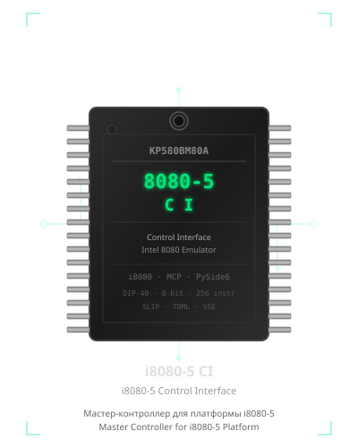

# i8080-5 CI

<p align="center">
  
</p>


---

## English

**i8080-5 CI** (i8080-5 Control Interface) — a comprehensive Master Controller for the i8080-5 hardware platform. Combines a full i8080/i8085 CPU emulator, interactive debugger, two-pass assembler (GUI and CLI), real-hardware bridge, and AI integration (MCP server) in a single desktop application.

## Русский

**i8080-5 CI** (i8080-5 Control Interface) — комплексная среда управления аппаратной платформой i8080-5: эмулятор i8080/i8085 CPU, отладчик, двухпроходный ассемблер (GUI и CLI), мост к реальному устройству и интеграция с AI-ассистентами в одном приложении.

---

## Screenshots / Скриншоты

| Main Window / Главное окно | Hex Editor / Hex-редактор | Disassembler / Дизассемблер |
|-------------|------------|--------------|
|  |  |  |

| Emulator / Эмулятор | Trace Log / Трассировка | Device Connection / Устройство |
|----------|-----------|-------------------|
|  |  |  |

| Micro-80 Profile | Specialist Profile |
|------------------|-------------------|
|  |  |

---

## Features / Возможности

### Emulation & Debugging / Эмуляция и отладка

**EN:**
- **Dual CPU: i8080 + i8085** — selectable CPU type; i8085 adds SIM/RIM, DSUB, ARHL, RDEL, LDHI/LDSI, RSTV, SHLX, JNK, LHLX, JK
- **Assembler** — built-in two-pass i8080/i8085 assembler with preprocessor (macros, includes, conditionals), syntax highlighting, load-to-memory, object files, and a linker (EXPORT/IMPORT, relocations, map files)
- **CLI Assembler** — headless command-line assembler `python -m assemble8080` (no GUI required)
- **VS Code Plugin** — `i8080-ci-vscode` extension with an MCP client for the headless server
- **i8080/i8085 CPU Emulator** — full 256-instruction set including undocumented instructions
- **Debugger** — breakpoints (regular & conditional), step / step-over, run-to, watch windows, trace log
- **Disassembler** — real-time with jump arrows and instruction-type highlighting
- **Hex Editor** — view and edit memory images with search and block operations
- **Memory Test** — RAM verification using various patterns (walking bit, chessboard, etc.)
- **Comparison** — diff current memory image against a reference file

**RU:**
- **Два CPU: i8080 + i8085** — выбор типа CPU; i8085 добавляет SIM/RIM, DSUB, ARHL, RDEL, LDHI/LDSI, RSTV, SHLX, JNK, LHLX, JK
- **Ассемблер** — встроенный двухпроходный ассемблер i8080/i8085 с препроцессором (макросы, include, условия), подсветкой синтаксиса, загрузкой в память, объектными файлами и линковщиком (EXPORT/IMPORT, переносы, map-файлы)
- **Ассемблер из командной строки** — автономный CLI-ассемблер `python -m assemble8080` (без GUI)
- **Плагин VS Code** — расширение `i8080-ci-vscode` с MCP-клиентом для headless-сервера
- **Эмулятор i8080/i8085 CPU** — полный набор из 256 инструкций, включая недокументированные
- **Отладчик** — точки останова (обычные и условные), пошаговое выполнение, run-to, watch-окна, трассировка
- **Дизассемблер** — в реальном времени со стрелками переходов и подсветкой типов команд
- **Hex-редактор** — просмотр и редактирование образов памяти с поиском и блочными операциями
- **Тест памяти** — проверка RAM различными паттернами (walking bit, шахматный и др.)
- **Сравнение** — сравнение текущего образа памяти с эталонным файлом

### Hardware Interface / Аппаратный интерфейс

**EN:**
- **Real Device Control** — read/write memory and IO ports via COM port (SLIP protocol)
- **IO Sequencer** — execute sequences of input/output operations
- **25+ IO Devices** — I8255, I8253, I8251, I8259, I8257, I8237, I8272, I8275, I8276, I8279, I16550, I512VI1, CF/IDE, CH376S (SD), AM9511, LCD1602, LCD2004, TFT8080, Keyboard 8x8, 3D Cube, Discrete Video, Bitmap Video, and more

**RU:**
- **Управление реальным устройством** — чтение/запись памяти и IO-портов по COM-порту (протокол SLIP)
- **IO Секвенсор** — выполнение последовательностей операций ввода-вывода
- **25+ IO-устройств** — I8255, I8253, I8251, I8259, I8257, I8237, I8272, I8275, I8276, I8279, I16550, I512VI1, CF/IDE, CH376S (SD), AM9511, LCD1602, LCD2004, TFT8080, Клавиатура 8x8, 3D-куб, Дискретное видео, Bitmap-видео и другие

### System Profiles / Системные профили

**EN:**
- **TOML-based profiles** for popular i8080 systems (see [System Profiles](#system-profiles--системные-профили))
- Dynamic device configuration with memory-mapped IO support
- Shadow ROM, banked, paged, and segmented memory models
- Port range inversion support (Mikro-80 PPI)

**RU:**
- **TOML-профили** для популярных i8080-систем (см. [Системные профили](#system-profiles--системные-профили))
- Динамическая конфигурация устройств с поддержкой MMIO
- Модели памяти: Shadow ROM, банкная, страничная, сегментная
- Поддержка инверсии диапазона портов (PPI Mikro-80)

### AI Integration / AI-интеграция

**EN:**
- **MCP Server** — integrate with AI assistants (Claude Desktop, Cursor, etc.) via SSE transport
- **Scripts** — Python automation for reproducible tests and workflows

**RU:**
- **MCP-сервер** — интеграция с AI-ассистентами (Claude Desktop, Cursor и др.) через SSE-транспорт
- **Скрипты** — автоматизация на Python для воспроизводимых тестов и рабочих процессов

### UI / Пользовательский интерфейс

**EN:**
- **PySide6** desktop GUI with **Russian / English** interface
- **Light / Dark** themes

**RU:**
- **PySide6** настольное GUI с интерфейсом на **русском и английском**
- **Светлая / Тёмная** темы

---

## Installation / Установка

### Requirements / Требования

**EN:**
- Python 3.10+
- PySide6, pyserial (installed automatically via requirements)

**RU:**
- Python 3.10+
- PySide6, pyserial (устанавливаются автоматически через requirements)

### Setup / Настройка

```bash
# Clone / extract / Клонировать / Распаковать
cd i8080-5_CI

# Create virtual environment / Создать виртуальное окружение
python -m venv .venv
.venv\Scripts\activate        # Windows
# source .venv/bin/activate   # Linux / macOS

# Install dependencies / Установить зависимости
pip install -r requirements.txt

# Run / Запустить
python i8080_CI.py
```

### Build EXE (Windows) / Сборка EXE (Windows)

```bash
pyinstaller --onefile --hide-console minimize-late --optimize 2 i8080_CI.py
```

---

## Command-Line Assembler (CLI) / Ассемблер из командной строки

**EN:** The assembler can be run headless from the command line — no GUI required.
Usage: `python -m assemble8080 [options] [files]`. With no arguments it runs a
built-in self-test. Exit code 0 = success, 1 = errors.

**RU:** Ассемблер можно запускать автономно из командной строки — без GUI.
Использование: `python -m assemble8080 [опции] [файлы]`. Без аргументов выполняется
встроенный self-test. Код выхода 0 = успех, 1 = ошибки.

| Option / Опция | Description / Описание |
|--------|-------------|
| `-o, --output` | Output binary file / Выходной бинарный файл |
| `-m, --map` | Generate a map file / Сформировать map-файл |
| `--obj` | Generate an object file (.obj) / Сформировать объектный файл (.obj) |
| `--cpu {8080,8085}` | Target CPU (default: 8080) / Целевой CPU (по умолчанию: 8080) |
| `--lnk` | Run the linker with a .lnk script / Запустить линковщик со скриптом .lnk |
| `--hex` | Output a hex dump / Вывести hex-дамп |
| `--list` | Generate a listing / Сформировать листинг |
| `--symbols` | Output the symbol table / Вывести таблицу символов |
| `-q, --quiet` | Quiet mode (CI) / Тихий режим (CI) |
| `--version` | Show version / Показать версию |

```bash
# Single file / Один файл
python -m assemble8080 -o out.bin program.asm

# Hex dump + symbols / Hex-дамп + символы
python -m assemble8080 --hex --symbols program.asm

# i8085 target / Целевой i8085
python -m assemble8080 --cpu 8085 -o out.bin program.asm

# Multi-file link / Линковка нескольких файлов
python -m assemble8080 --lnk build.lnk

# Quiet CI mode / Тихий режим CI
python -m assemble8080 -q -o out.bin program.asm
```

---

## Project Structure / Структура проекта

```
i8080_CI.py                # Entry point / Точка входа (thin wrapper)
i8080_emulator.py          # i8080/i8085 CPU emulator / Эмулятор i8080/i8085 (QObject, Qt Signals)
mcp_server.py              # MCP Server / MCP-сервер (FastMCP, SSE)
mcp_headless.py            # Headless MCP server / Headless MCP-сервер
version.py                 # Project version / Версия проекта
assemble8080/              # i8080/i8085 assembler / Ассемблер i8080/i8085 (two-pass, preprocessor, linker)
│   __main__.py            #   CLI entry point / Точка входа CLI (python -m assemble8080)
│   assembler.py           #   Assembler core / Ядро ассемблера (relocations)
│   preprocessor.py        #   Preprocessor / Препроцессор (macros, includes, #if, #path)
│   numbers.py             #   Number parser / Парсер чисел
│   symbols.py             #   Symbol table / Таблица символов
│   errors.py              #   Error types / Типы ошибок
│   mapfile.py             #   Map file gen/parse / Генерация/парсинг map-файлов
│   objfile.py             #   Object file format / Формат объектного файла (.obj)
│   linker.py              #   Linker / Линковщик (.lnk scripts, relocations)
common/                    # Common utilities / Общие утилиты
│   i18n.py                #   Internationalization / Интернационализация (RU/EN)
│   encoding.py            #   File encoding auto-detect / Автоопределение кодировки файлов
│   themes.py              #   Light/Dark themes / Светлая/тёмная темы
assembler_example/         # Assembler examples / Примеры ассемблера (single & multi-file, build scripts)
i8080_ci/                  # Application package / Пакет приложения
│   i18n.py                #   Internationalization / Интернационализация (RU/EN, themes)
│   slip.py                #   SLIP protocol / Протокол SLIP (constants, encode/decode)
│   intelhex.py            #   Intel HEX parser/generator / Парсер/генератор Intel HEX
│   disassembler.py        #   i8080 disassembler / Дизассемблер i8080
│   assembler_widget.py    #   Assembler tab / Вкладка ассемблера
│   bus_worker.py          #   Serial bus worker / Рабочий шину (QThread)
│   automation.py          #   AutomationAPI / API автоматизации (script interface)
│   headless_host.py       #   Headless host / Headless-хост (MCP без GUI)
│   main_window.py         #   MainWindow / Главное окно (QMainWindow)
│   models/
┃       hex_model.py       #     HexEditor table model / Модель hex-редактора
┃       watch_model.py     #     Watch window model / Модель watch-окна
┃       bp_model.py        #     Breakpoint model / Модель точек останова
┃       trace_model.py     #     Trace log model / Модель трассировки
│   views/
┃       disasm_view.py     #     Disassembler view / Вид дизассемблера (jump arrows)
┃       hex_view.py        #     Hex editor table view / Вид hex-редактора
┃       search.py          #     Search dialog / Диалог поиска
modules/                   # Hardware abstraction / Аппаратное абстрагирование
│   system.py              #   ComputerSystem / ComputerSystem - integration hub
│   memory/                #   Memory models / Модели памяти (banked, paged, shadow, MMIO)
│   io/                    #   IO devices / IO-устройства (I8255, I8253, I8272, I16550, ...)
│   config/                #   Device config / Конфигурация устройств & profiles
ui/                        # Additional widgets / Дополнительные виджеты (device manager, etc.)
profiles/                  # TOML system profiles / TOML-профили систем
roms/                      # ROM images / Образы ROM
tests/                     # Test suite / Набор тестов (pytest)
Plugins/                   # Plugins / Плагины
│   i8080_ci-vscode/       #   VS Code extension / Расширение VS Code (MCP-клиент)
requirements.txt           # Python dependencies / Python-зависимости
pyproject.toml             # Project metadata / Метаданные проекта
logo.svg                   # Project logo / Логотип проекта
```

---

## MCP Server / MCP-сервер

**EN:** The built-in MCP server allows AI assistants to interact with the emulator and connected hardware:

1. Launch the application
2. Enable MCP Server (button in main window or checkbox) — or run headless: `python mcp_headless.py --profile full --port 8000`
3. Connect an AI client — example for Claude Desktop:

**RU:** Встроенный MCP-сервер позволяет AI-ассистентам взаимодействовать с эмулятором и подключённым оборудованием:

1. Запустите приложение
2. Включите MCP Server (кнопка в главном окне) — или запустите headless: `python mcp_headless.py --profile full --port 8000`
3. Подключите AI-клиент — пример для Claude Desktop:

```json
{
  "mcpServers": {
    "i8080": {
      "url": "http://127.0.0.1:8000/sse"
    }
  }
}
```

### Available Tools / Доступные инструменты

**EN:** 70 tools, grouped by category:

**RU:** 70 инструментов, сгруппированных по категориям:

| Category / Категория | Tools |
|----------|-------|
| Emulator control / Управление эмулятором | `emu_reset`, `emu_step_into`, `emu_step_over`, `emu_run`, `emu_run_to`, `emu_stop`, `emu_get_state`, `emu_set_pc`, `emu_set_interrupts`, `emu_request_interrupt`, `emu_read_word`, `emu_write_word`, `emu_push`, `emu_pop` |
| Registers / PSW / Flags / Регистры, PSW, флаги | `emu_get_reg`, `emu_set_reg`, `emu_get_psw`, `emu_set_psw`, `emu_get_flags`, `emu_set_flag` |
| Breakpoints / Точки останова | `emu_add_breakpoint`, `emu_remove_breakpoint`, `emu_list_breakpoints`, `emu_clear_breakpoints`, `emu_add_conditional_breakpoint`, `emu_set_bp_condition`, `emu_toggle_bp_enabled`, `emu_get_bp_info` |
| Disasm / Stack / Trace / Дизассемблер, стек, трассировка | `emu_disassemble`, `emu_get_stack`, `emu_trace`, `emu_trace_start`, `emu_trace_stop`, `emu_trace_clear`, `emu_trace_get`, `emu_trace_export` |
| IO / Bus / IO, шина | `emu_get_io_ports`, `hold_bus`, `unhold_bus`, `wait_bus`, `wait_unhold` |
| Memory / Память | `read_mem`, `write_mem`, `read_block`, `write_block`, `fill_mem` |
| Device / Устройство | `dev_read_mem`, `dev_write_mem`, `dev_read_io`, `dev_write_io`, `download`, `upload` |
| Analysis / Анализ | `disassemble`, `search`, `load_file`, `save_file`, `get_status`, `refresh` |
| Assembler / Ассемблер | `asm_assemble`, `asm_get_source`, `asm_set_source`, `asm_get_errors`, `asm_get_labels` |
| System / Система | `get_cpu_type`, `set_cpu_type`, `get_version`, `get_language`, `set_language`, `run_script`, `get_watch_list` |

**EN:** In addition to the tools, the server exposes **6 MCP resources** (`memory://current`, `memory://disassembly`, `status://info`, `emulator://state`, `emulator://stack`, `emulator://breakpoints`) and **9 MCP prompts** (`analyze_firmware`, `find_bugs`, `create_test_program`, `explain_code`, `debug_program`, `find_infinite_loop`, `explain_instruction`, `trace_execution`, `setup_conditional_debugging`).

**RU:** Помимо инструментов, сервер предоставляет **6 MCP-ресурсов** (`memory://current`, `memory://disassembly`, `status://info`, `emulator://state`, `emulator://stack`, `emulator://breakpoints`) и **9 MCP-промптов** (`analyze_firmware`, `find_bugs`, `create_test_program`, `explain_code`, `debug_program`, `find_infinite_loop`, `explain_instruction`, `trace_execution`, `setup_conditional_debugging`).

Full guide / Полное руководство: [MCP_GUIDE.md](MCP_GUIDE.md)

---

## System Profiles / Системные профили

| Profile / Профиль | Description / Описание |
|---------|-------------|
| `micro80` | Mikro-80 (16 KB RAM, I8255, Keyboard 8x8, port inversion) / Микро-80 (16 КБ RAM, I8255, клавиатура, инверсия портов) |
| `microsha` | MicroSha (32 KB RAM, I8253, I8255) |
| `radio86rk` | Radio-86RK (64 KB RAM, I8255, I8279, I8253) |
| `apogey` | Apogey (64 KB RAM, I8255, I8279, video) |
| `orion128` | Orion-128 (128 KB RAM, expanded IO) |
| `vector06c` | Vector-06C (vector display) |
| `specialist` | Specialist (full IO set, bitmap video) / Специалист (полный набор IO, bitmap-видео) |
| `full` | Full device set (all supported modules) / Полный набор устройств |
| `empty` | Minimal configuration (CPU only) / Минимальная конфигурация (только CPU) |

Profile files / Файлы профилей: `profiles/` (TOML format / TOML-формат)

---

## Testing / Тестирование

**EN:** 60+ test files: `run_tests.py` (921 passed, 0 failed), the zasm reference
comparison `tests/test_bin_compare.py` (15 reference files, byte-identical), the
round-trip test `tests/test_roundtrip_256.py` (assemble → disassemble → re-assemble,
3 consecutive cycles), `tests/test_8085.py`, and GUI smoke tests. Full cycle:
`python _run_all_tests.py`.

**RU:** 60+ тест-файлов: `run_tests.py` (921 пройдено, 0 провалов), сравнение с
эталонами zasm `tests/test_bin_compare.py` (15 эталонных файлов, побайтово),
round-trip тест `tests/test_roundtrip_256.py` (ассемблирование → дизассемблирование →
повторная сборка, 3 последовательных цикла), `tests/test_8085.py` и GUI smoke-тесты.
Полный цикл: `python _run_all_tests.py`.

```bash
# Run the full test cycle (standalone + api snippets) / Полный цикл тестов
python _run_all_tests.py

# Run all unit tests / Запустить все юнит-тесты
python run_tests.py

# Run zasm reference comparison / Сравнение с эталонами zasm
python tests/test_bin_compare.py

# Run round-trip test (assemble → disassemble → re-assemble) / Round-trip тест
python tests/test_roundtrip_256.py

# Run a specific test file / Запустить конкретный файл тестов
python tests/test_i8255.py

# Run emulator standalone / Запустить эмулятор самостоятельно
python i8080_emulator.py
```

---

## Documentation / Документация

| Document / Документ | Description / Описание |
|----------|-------------|
| [USER_GUIDE.md](USER_GUIDE.md) | User guide / Пользовательское руководство |
| [MCP_GUIDE.md](MCP_GUIDE.md) | MCP integration guide / Руководство по MCP-интеграции |
| [SCRIPTS_GUIDE.md](SCRIPTS_GUIDE.md) | Automation scripts guide / Руководство по скриптам |
| [ASSEMBLER_GUIDE.md](ASSEMBLER_GUIDE.md) | Assembler programmer's guide / Руководство программиста по ассемблеру |
| [ANALYSIS.md](ANALYSIS.md) | Technical project analysis / Технический анализ проекта |
| [CHANGES.md](CHANGES.md) | Changelog / Журнал изменений |
| [I18N_AUDIT.md](I18N_AUDIT.md) | i18n audit report / Аудит интернационализации |

---

## Hardware Module / Аппаратный модуль

**EN:** **8080-5-CI Module** — debug and download board for the i8080-5 platform.

**RU:** **Модуль 8080-5-CI** — плата для отладки и прошивки платформы i8080-5.

GitHub: https://github.com/R2AKT/8080-5-CI

---

## License / Лицензия

[MIT](LICENSE)

License addendum / Дополнение к лицензии: [Addendum.txt](Addendum.txt)
